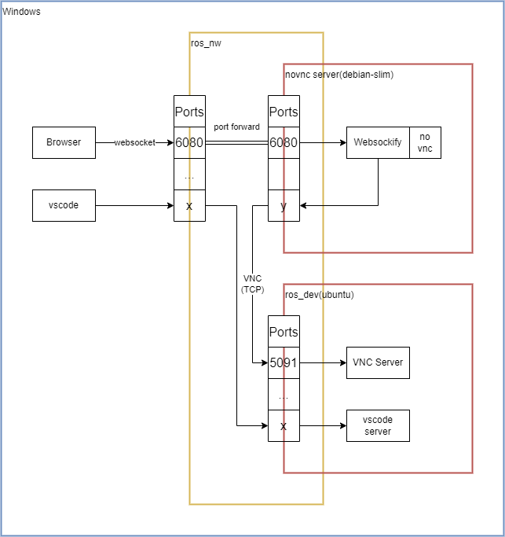

# ros_tutorial

ROS Tutorial

## NW図

> 注：現状、nvnvcとvncに疎通障害発生中

## VNCデスクトップ環境

<http://localhost:6080/vnc.html>

- password: ros_dev

## 環境説明

> [ja/ROS/Tutorials](http://wiki.ros.org/ja/ROS/Tutorials)

- [x] [ROS環境のインストールとセットアップ](http://wiki.ros.org/ja/ROS/Tutorials/InstallingandConfiguringROSEnvironment)
  - [x] 1. ROSのインストール（ros:noeticイメージで実施済み）
  - [x] 2. 環境変数を管理する（vncserver/dockerfileで実施済み）
  - [x] 3. ROSのワークスペースを作成する（catkin_ws内の[README.md](./catkin_ws/README.md)参照）
- [x] rosdep初期化更新済み（ros image）
- [x] catkin_wsの作成
